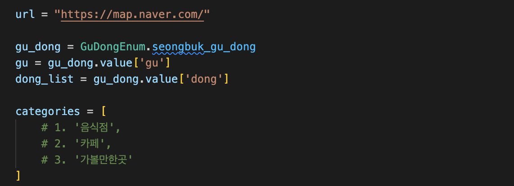
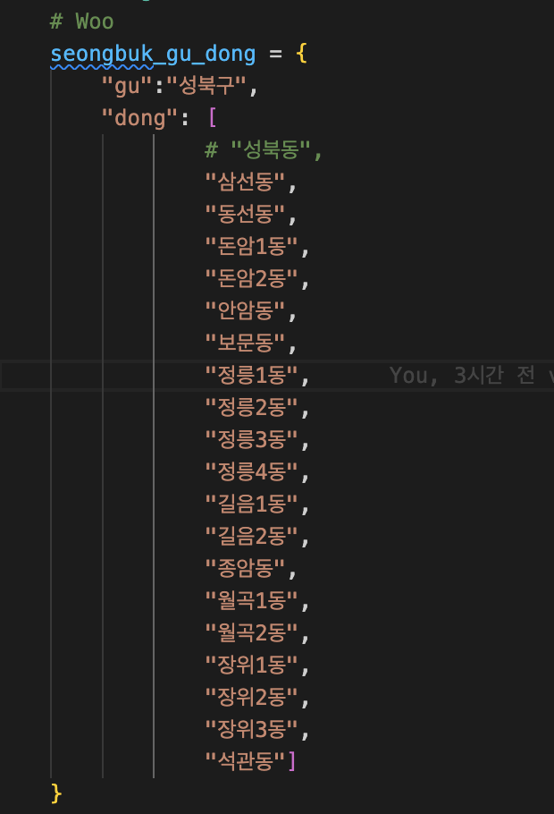

# HowAbout RAG DATA CRAWLER

## How To Guides

### Setting up the environment

1. Create a directory for `RAG-DATA`
2. Clone `RAG-DATA` repository

3. Change your directory to `ha-crawler`

    ```bash
    yourDirectory/RAG-DATA/
    cd ha-crawler
    ```

4. Create python virtual environment and activate it.

    ```bash
    python3 -m venv .crawler_venv
    source .crawler_venv/bin/activate
    ```

5. Install `requirements.txt` (Make sure your venv activated)

    ```bash
    pip install -r requirements.txt 
    ```

6. Run crawler

    ```bash
    python3 gu_dong_crawler.py
    ```

### Modifying Crawler & Crawling

#### Korean time~~

크롤링을 하기 위해 위의 기본적인 설정 이후 아래와 같은 작업을 해야합니다.

1. 먼저 IDE를 열어(`RAG-DATA` 기준) `gu_dong_crawler.py` 에 들어가서 아래의 내용을 수정합니다.

    ```python
    gu_dong = GuDonEnum.(Enum class에서 확인 ㄱㄱ)
    gu = gu_dong.value['gu']
    dong = gu_dong.value['dong']
    ```

    

    - 현재 음식점, 카페, 가볼만한곳 3곳을 주석처리를 해제 해도 정상 작동하는걸 확인했으나 계속 꺼질 시에는 음식점 -> 카페 -> 가볼만한곳 순으로 크롤링을 진행해 주시기 바랍니다.(단 카테고리가 바뀔때마다 화면이 다시 로딩 되기 때문에 갑작스러운 화면 전환이 있을 수 있습니다.)

2. Enum 클래스 안에 각자에게 할당된 크롤링 구역이 써있습니다. 저희 목표는 전체다가 아닌 최대한 많이이니 너무 부담 갇지 마시고 진행해 주시기 바랍니다. 
3. 한 동네가 끝나면 그 동을 주석처리 해주시고 진행하시는게 정신건강에 좋습니다.(내일 이 크롤링을 백번 반복하는 shell script를 올려 오류가 발생해도 다시 작동하도록 만들어 드리겠습니다.)
4. 수동적인 부분이 좀 있지만 전체 자동으로 진행할시에는 결측치가 너무 많이 발생해서 안타깝게도 수동적인 부분이 존재합니다.
5. 아래의 사진처럼 각자에게 할 당된 데이터 크롤링 지역을 확인할 수 있습니다.
    

### 크롤링이 멈추는 경우

1. 하나의 구에 대한 크롤링이 완료 됐을 때
2. 인터넷 속도가 느릴 때
3. 스크롤 다운을 실행하지 않았을 때
4. 크롤링이 진행 되는 화면에 크롤링에 영향을 주는 심한 조정이 있을 때

### 해결방안(Quick Fix)

1. 크롤러 재실행
2. 크롤러 작동화면으로 잠시 이동하기 -> 컴퓨터가 지금 현재 보여지는 부분에 가장 많은 리소스를 쓴다고 합니다. 그러니 그 부분을 한번 봐주시면 잘됩니다.(우리가 집중 안됐을 때 뒤에 누가 보고 있으면 열심히 하게 되는것과 유사합니다.)
3. 크롤링이 완료된 동을 주석처리 해주시면 됩니다. -> 크롬 브라우져가 지친경우 혹은 컴퓨터 메모리가 부족한 상황입니다. 이부분 어쩔 수 없이 크롤러 범위를 줄이셔야 합니다.

### 주의사항

1. 절대! 크롤러가 보는 화면을 끄시면 안됩니다.
2. `sleep()` 부분이 있습니다. 절대! 건드시면 안됩니다. -> ec로 로딩 될 때까지 기다리게도 만들었는데 부족해서 추가한 부분입니다. 그러니 절대로 건드시면 안됩니다.
3. 대부분의 문제는 로딩이 지연 돼서 발생하고 있습니다. 동을 주석 처리 하거나 재실행을 진행해주시기 바랍니다.
4. 또한 팁을 드리자면 크롤링이 시작 될 때 크롤링 화면을 전체화면으로 바꿔주시면 좋습니다.
5. 여러분들에게 저의 일을 나눈거 같아 마음이 안좋습니다. 그런데 이 크롤링은 필수가 아니라 다양한 정보를 확보하기 위함이니 너무 큰 부담을 갖으시지 않길 바랍니다.
6. 크롤링 시작 혹은 진행과 관련하여 어려움이 있다면 연락 주세요!
